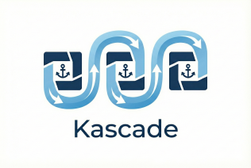
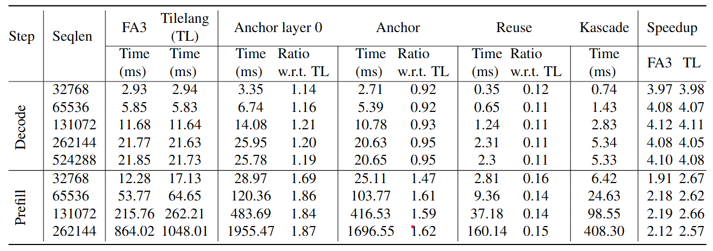
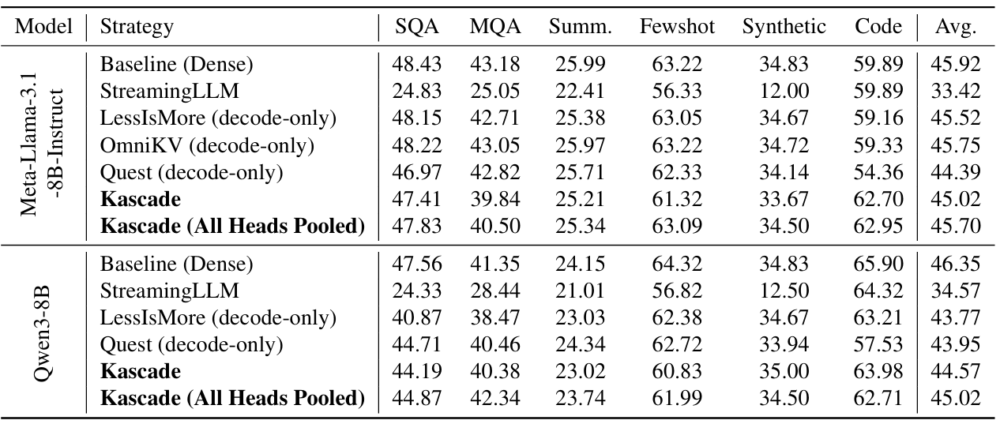
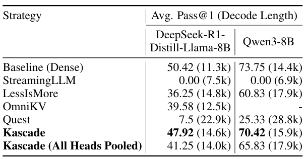

<p align="center">
  <picture>
    
  </picture>
</p>

<h3 align="center">
 A Practical Sparse Attention Method for Long-Context LLM Inference
</h3>

<p align="center">
| <a href="#"><b>Paper</b></a> |
</p>

## Abstract

Attention is the dominant source of latency during long-context LLM inference, an increasingly popular workload with reasoning models and RAG. We propose Kascade, a training-free sparse attention method that leverages known observations such as 1) post-softmax attention is intrinsically sparse, and 2) the identity of high-weight keys is stable across nearby layers. Kascade computes exact Top-*k* indices in a small set of **anchor** layers, then reuses those indices in intermediate **reuse** layers. The **anchor** layers are selected algorithmically, via a dynamic-programming objective that maximizes cross-layer similarity over a development set, allowing easy deployment across models. The method incorporates efficient implementation constraints (e.g. tile-level operations), across both prefill and decode attention. The Top-*k* selection and reuse in Kascade is _head_-aware and we show in our experiments that this is critical for high accuracy. Kascade achieves up to $4.1 \times$ speedup in decode attention and $2.2 \times$ speedup in prefill attention over FlashAttention-3 baseline on H100 GPUs while closely matching dense attention accuracy on long-context benchmarks such as LongBench and AIME-24.

Below are speedup results for Top-$k$ set to 10%:
<p align="center">
  <picture>
    
  </picture>
</p>

## Quick Start

### Prerequisites

- NVIDIA GPU (For running our efficient kernels need H100 or hopper architecture GPU. For running only accuracy evals using unoptimized PyTorch code other GPUs should be fine)
- CUDA 12.8+
- Conda

### Installation

```bash
# 1. Create conda environment
conda create -n kascade python=3.12.11
conda activate kascade

# 2. One-command install (builds all dependencies)
./install.sh
```
If you want to use models on HuggingFace that have gated access(Llama models) then create a token by following instructions at https://huggingface.co/docs/hub/security-tokens.
A token with read scope should be enough just for using the models. After running the below command paste the token.

```bash
huggingface-cli login
```

## Running Evaluations and Performance Benchmarks

To run kascade evals one needs to first get the best set of anchor layers and head mappings to be used for that model. To get these follow the below instructions:
### For existing models
For `Qwen/Qwen3-8B`, `meta-llama/Llama-3.1-8B-Instruct` and `deepseek-ai/DeepSeek-R1-Distill-Llama-8B` which were used for evaluations in the paper the best head mappings are already stored at `./results/head_mappings` in `.npy` format. 
The name of the file also gives the set of layers corresponding to the head_mapping. These can be used directly.

### For new models
For any model apart from the above mentioned models one can easily generate the best set of layers and head mappings by running the below script:
```bash
python scripts/eval_script.py --model_name [MODEL_NAME] --dataset_name bdsaglam/musique --subsets answerable --num_queries 1000 --strategies post_softmax_pooled_prefill_topk --tile_size 32 --run_type select_layers 
```
This will print layer combos starting from no. of anchor layers = 3 to 8. Also, the head_mappings for each will be stored in `results/head_mappings` folder in `.npy` format. Each file is labeled as `<model_name>_<recompute layers separated by _>.npy`.
You can choose the combo you want from above and make sure to pass these set of recompute layers to the evaluation scripts for that model. Note that the set of layers generated is only for Kascade. For competitor methods like OmniKV and LessIsMore refer to their papers on how to get they layers for a given model.

**Note**: If you have multiple GPUs available on the node then you can run `scripts/eval_script.py` with `accelerate launch` instead of just `python` to take advantage of DDP for faster processing of queries. Be aware that for evals like quest which run slowly this might cause timeout issues. For stats runs on large amount of queries it might cause out of memory issues. In these case it advised to use normal `python`.
Currently, batch-size 1 is supported for running evals. 

Below is the template for running evaluation on one of the supported datasets using a given model and a set of strategies
```bash
python scripts/eval_script.py --model_name [MODEL_NAME] --dataset_name [DATASET_NAME] --subsets [SUBSET_IN_DATASET] --num_queries [NUM_QUERIES] --strategies [strategy-name-1] [strategy-name-2] ... [strategy-name-n] --strategy-specific-args --store_results{OPTIONAL}
```
Example for kascade is given below:
```bash
python scripts/eval_script.py --model_name meta-llama/Meta-Llama-3.1-8B-Instruct --dataset_name bdsaglam/musique --subsets answerable --strategies efficient_kascade --tile_size 32 --recompute_layers 0 2 8 13 14 --rolling_prefill
```
The head mappings don't need to be provided explicitly. Given the recompute layers and the model, automatically the corresponding mapping from the head_mappings folder will be picked.

**NOTE:** Currently for `efficient_kascade` which uses our efficient kernels only tile_size 32 is supported.

The above command will run the given model on that dataset with all the strategies once and print the results in below format per strategy:
```bash
# model_name, dataset_name, subset, seed, num_queries, prompt_template, strategy-args(like name, tile_size, recompute_layers, etc), accuracy metric, avg. prefill tokens, avg. decode tokens, wall clock time
meta-llama/Meta-Llama-3.1-8B-Instruct,bdsaglam/musique,answerable,0,100,0,efficient_kascade,10,32,False,[0, 2, 8, 13, 14],0.37323,2304.06,6.96,21.101
```
The last four numbers i.e. the accuracy_metric, avg. prefill tokens, avg. decode tokens and wall clock time will always come in that order. If `--store_results` is given then the result will also be stored in a similar format in `./results/evals/model_name/strategy_name` folder in a `.csv` file.  


### [Longbench](https://huggingface.co/datasets/zai-org/LongBench) Evaluations
<p align="center">
  <picture>
    
  </picture>
</p>
To get results in Table 1 run below file as it is

```bash
python eval_lb.py
```
The file runs a given set of strategies and models on all Longbench datasets and average the results across the different types of subsets in Longbench and stores them. 

### [AIME-24](https://huggingface.co/datasets/HuggingFaceH4/aime_2024) Evaluations
<p align="center">
  <picture>
    
  </picture>
</p>
To get results in Table 2 run below file as it is

```bash
python eval_aime.py
```
The file runs a given set of strategies and models on all AIME-24 datasets and aggregates the results across the different types of subsets in AIME-24. For every model and strategy pair it will do `NUM_RUNS`(by default 8) since they use samplings. The sampling params are set to values recommended by the official huggingface model pages. The final results averaged across `NUM_RUNS` are stored.

For above both set of evals for Longbench and AIME-24, if one wants to run different models and strategies per model they can update the `MODELS` list. The averaged results are store at `./results/summary`. The individual results are stored at `./results/evals`.

### Kernel Benchmarks (H100 or hopper architecture needed)

```bash
# Full benchmark suites
python scripts/benchmark_prefill.py --all
python scripts/benchmark_decode.py --all

# Individual kernel benchmarks
python scripts/benchmark_prefill.py --kernel recompute --seq_len 8192 --topk 10 --layer 0 --mode benchmark

python scripts/benchmark_decode.py --kernel recompute --kv_seqlen 8192 --topk 10 --layer 0 --mode benchmark

# Correctness tests
python scripts/benchmark_prefill.py --kernel recompute --mode correctness
python scripts/benchmark_decode.py --kernel reuse --mode correctness
```
**NOTE:** Currently only certain configs(like tile_size=32) are supported for the kernels. More flexibility may be added in future. Support for paged and varlen Kernels will be added soon!

## Reproduciblity

### Plot Attention Sparsity per Layer per Head
Below command generated Figure 1:
```bash
python scripts/eval_script.py --model_name meta-llama/Meta-Llama-3.1-8B-Instruct --dataset_name bdsaglam/musique --subsets answerable --num_queries 1000 --strategies oracle_topk --run_type plot_sparsity
```

### Plot Cross-Layer Similarity
Below command generates Figure 3:
```bash
python scripts/eval_script.py --model_name meta-llama/Meta-Llama-3.1-8B-Instruct --dataset_name bdsaglam/musique --subsets answerable --num_queries 1000 --strategies post_softmax_all_heads_pooled_oracle_topk  --run_type plot_similarity
```

### Plot Layer-Importance
The same command as given in [running evaluations for new models](#for-new-models) will generate the plot.

### Ablations
To run all ablations
```bash
python ablations.py --all
```

To run a specific ablation 1(Figure 2), 2(Figure 5) or 3(Figure 6)
```bash
python ablations.py --ablation 1
```

The generated plots are stored at `./results/plots`. The individual results are stored at `./results/evals`.

### Python API

```python
import kascade

# Load model with Kascade attention
from kascade.model_utils import get_tokenizer_and_model
model_name = "meta-llama/Meta-Llama-3.1-8B-Instruct"
model, tokenizer = get_tokenizer_and_model(model_name, "sdpa", "cuda")

# Use strategies
from kascade.strategies import EfficientKascadeStrategy
strategy = EfficientKascadeStrategy(recompute_layers=[0,2,8,13,14], model_name=model_name, k=10, tile_size=32, rolling_prefill=True)
output = strategy.generate(prompt, context)
```

## Project Structure

```
kascade/
├── install.sh              # One-command installation
├── pyproject.toml          # Package configuration
├── assets/                 # Images used in README.md
├── results/                # For storing head_mappings and other results generated during experiments
    ├── head_mappings/      # Head mappings for kascade used in experiments
├── scripts/                # CLI scripts and benchmarks
│   ├── eval_script.py      # Main evaluation script
│   ├── eval_lb.py          # LongBench evaluation
│   ├── eval_aime.py        # AIME evaluation
│   ├── benchmark_prefill.py # Unified prefill benchmark
│   └── benchmark_decode.py  # Unified decode benchmark
├── src/                    # Main package (import kascade)
│   ├── kernels/            # CUDA attention kernels
│   │   ├── flash_attention/
│   │   └── flash_decoding/
│   ├── metrics/
│   ├── qadatasets/
│   ├── runners/
│   ├── strategies/
│   ├── model_utils.py
│   └── utils.py
└── third_party/            # Built dependencies (git submodules)
```

## Citation

If you find Kascade useful, please cite our work:

```bibtex
@article{kascade2024,
  title={Kascade: Efficient Sparse Attention for Long-Context RAG},
  author={},
  journal={},
  year={2024}
}
```

## Acknowledgments

Kascade builds on excellent open-source projects:

- [Transformers](https://github.com/huggingface/transformers) - State-of-the-art pretrained models for inference and training
- [TileLang](https://github.com/tile-ai/tilelang) - Domain-specific language designed to streamline the development of high-performance GPU/CPU/Accelerators kernels

Some of metrics and evaluation related code is borrowed from the below open-source projects:
- [Longbench](https://github.com/THUDM/LongBench/tree/main/LongBench) - A Bilingual, Multitask Benchmark for Long Context Understanding
- [math-evaluation-harness](https://github.com/ZubinGou/math-evaluation-harness) - A simple toolkit for benchmarking LLMs on mathematical reasoning tasks. 

We also use FlashAttention-3 code for benchmarking
- [Flash Attention](https://github.com/Dao-AILab/flash-attention) - Fast and memory-efficient attention


### Trademark Notice

This project may contain trademarks or logos for projects, products, or services. Authorized use of Microsoft trademarks or logos is subject to and must follow Microsoft’s Trademark & Brand Guidelines. Use of Microsoft trademarks or logos in modified versions of this project must not cause confusion or imply Microsoft sponsorship. Any use of third-party trademarks or logos are subject to those third-party’s policies.